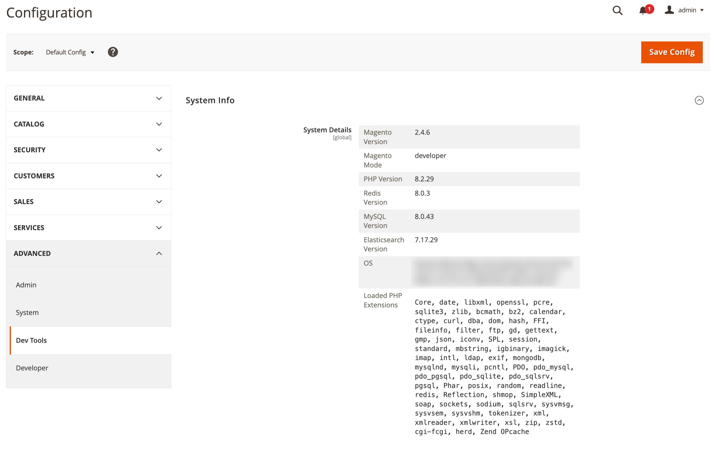
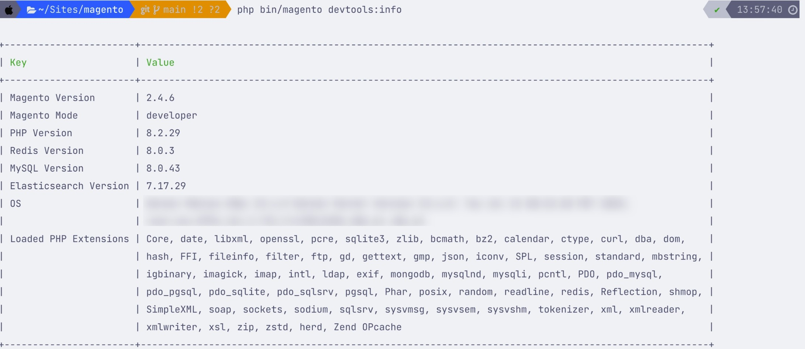

# Magento 2 Developer System Info Module

This Magento 2 module provides detailed system information useful for developers, directly in the **Admin panel** and via **CLI**.

## 🔍 Features

- Magento version & mode
- PHP version & extensions
- MySQL version
- Redis version
- Elasticsearch version
- Operating system info

## 📦 Installation

### 📦 Option 1: Manual installation (recommended for local dev)

```bash
mkdir -p app/code/MatusStafura/SystemInfo
git clone https://github.com/matusstafura/matusstafura-magento2-systeminfo.git app/code/MatusStafura/SystemInfo
```

Then enable the module:

```bash
php bin/magento module:enable MatusStafura_SystemInfo
php bin/magento setup:upgrade
php bin/magento cache:flush
```

---

### 🔧 Option 2: Manual installation (recommended for local dev)

```bash
mkdir -p app/code/MatusStafura/SystemInfo
git clone https://github.com/matusstafura/matusstafura-magento2-systeminfo.git app/code/MatusStafura/SystemInfo
````

Then run:

```bash
php bin/magento module:enable MatusStafura_SystemInfo
php bin/magento setup:upgrade
php bin/magento cache:flush
```

## 🧪 Usage

### Admin Panel

Go to:

> Stores → Configuration → Advanced → Dev Tools → **System Info**


You’ll see a table with system info formatted for easy reading.

### CLI

Run:

```bash
php bin/magento devtools:info
```



